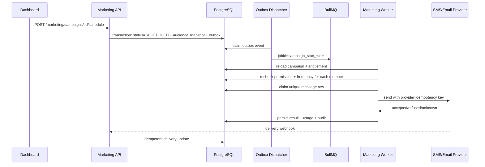

# Plan de bataille Sokar — offres 199/299 € et trajectoire CRM/marketing

Date de référence : 12 septembre 2026
Statut : plan directeur et blueprint technique à exécuter par lots validables
Horizon indicatif : 6 à 9 mois pour une suite solide destinée aux indépendants ; 12 à 18 mois pour approcher la largeur fonctionnelle de SevenRooms
Hypothèse de capacité : un développeur principal à temps plein, Hamza disponible pour les décisions produit, les pilotes et les validations terrain

> Les prix 199/299 € sont une cible, pas les prix actuellement affichés ou facturés. Le statut
> consolidé de la documentation se trouve dans
> [`DOCUMENTATION_STATUS.md`](./DOCUMENTATION_STATUS.md).

## 1. Décision produit

Sokar ne doit pas attendre d'égaler SevenRooms pour facturer 199 ou 299 € par mois. Le prix doit être justifié par deux résultats simples et mesurables :

- **Essential — 199 € HT/mois/établissement** : Sokar répond aux appels, prend et modifie les réservations sans erreur, synchronise le planning et réduit le travail manuel de l'équipe.
- **Pro — 299 € HT/mois/établissement** : Sokar ajoute une connaissance client exploitable, des relances ciblées et la mesure des réservations générées.

La trajectoire SevenRooms vient ensuite : caisse, revenu réel, protection bancaire, marketing avancé, CRM groupe, réputation, fidélité, événements et écosystème d'intégrations.

La priorité n'est donc pas le nombre de fonctionnalités. Elle est la fermeture complète de chaînes de valeur :

```text
Essential
appel ou widget → disponibilité fiable → réservation → rappel → service → résultat visible

Pro
interaction → profil enrichi → segment → campagne → réservation → visite → résultat attribué

Avec caisse
visite → ticket de caisse → dépense client → segment de valeur → campagne → revenu encaissé attribué
```

## 2. État réel de départ

### 2.1 Ce qui existe déjà

| Domaine      | Socle existant                                                                                  | Source principale                                                                  |
| ------------ | ----------------------------------------------------------------------------------------------- | ---------------------------------------------------------------------------------- |
| Réservations | Réservation voix, web et agentique, disponibilité, holds, idempotence, états et audit           | `apps/api/src/modules/reservations/`, `apps/api/src/modules/agentic-reservations/` |
| Téléphone IA | Telnyx Media Stream, STT ElevenLabs, LLM, TTS Cartesia, transfert humain, télémétrie de latence | `apps/api/src/modules/voice/`                                                      |
| Salle        | Plan de salle, tables, allocation, walk-ins, service live et liste d'attente                    | `apps/api/src/modules/floor-plan/`                                                 |
| Client       | Nom, téléphone, visites, VIP, notes, occasion, dernier appel, groupe habituel                   | `apps/api/src/modules/customers/` et modèle `Customer`                             |
| Réactivation | Détection hebdomadaire des VIP inactifs 90–180 jours, validation gérant, envoi SMS              | `apps/api/src/shared/queue/workers/reactivation.worker.ts`                         |
| Consentement | Opt-in marketing, retrait, export et effacement RGPD                                            | `apps/api/src/modules/rgpd/` et modèle `CustomerConsent`                           |
| Analyse      | Appels, réservations, couverts, revenu estimé, latence, économie de commission estimée          | `apps/api/src/modules/analytics/`                                                  |
| Multi-site   | Compte, établissements, rôles, sélection de site, quantité facturée                             | modèles `RestaurantAccount*` et routes associées                                   |
| Paiement     | Stripe Billing pour Sokar et Stripe pour les cartes cadeaux                                     | `apps/api/src/modules/billing/`, `apps/api/src/modules/gift-cards/`                |

### 2.2 Limites à ne pas masquer commercialement

- Le fichier client est encore centré sur le téléphone et quelques champs libres. Il n'a ni tags structurés, ni segments sauvegardés, ni historique de dépenses.
- La réactivation est un scénario unique, réservé aux VIP et semi-automatique. Ce n'est pas encore un moteur de campagnes.
- Le revenu affiché est souvent estimé à partir du ticket moyen. Il ne correspond pas à un encaissement observé.
- `CallQuota` compte les appels. Il ne mesure pas la durée, les coûts STT/LLM/TTS, les SMS ni les dépassements facturables.
- Aucun connecteur de caisse métier n'a été identifié dans le dépôt.
- Stripe pour les cartes cadeaux ne constitue pas un parcours d'empreinte bancaire ou d'acompte de réservation.
- Le multi-site a un socle technique, mais l'isolation avec plusieurs identités réelles et le CRM client partagé restent à valider.
- Les prix codés sont encore 149/249 €. La page, les constantes, Stripe, les contrats et les calculs ROI doivent migrer ensemble.

## 3. Périmètre commercial cible

### 3.1 Essential — porte de mise en vente à 199 €

Essential est vendable lorsque tous les éléments suivants fonctionnent de bout en bout :

1. accueil téléphonique 24/7 avec transfert ou solution de secours ;
2. création, modification et annulation de réservation ;
3. disponibilité et capacité cohérentes sur tous les canaux ;
4. planning et plan de salle utilisables pendant un service ;
5. confirmation/rappel avec visibilité des échecs ;
6. widget direct sans commission ;
7. fichier client, notes et historique de base ;
8. onboarding reproductible ;
9. mesure des appels, minutes, réservations et coûts directs ;
10. facturation 199 € cohérente sur toutes les surfaces.

### 3.2 Pro — porte de mise en vente à 299 €

Pro devient vendable comme offre supérieure lorsque le client peut :

1. reconnaître un habitué et consulter une chronologie utile ;
2. filtrer les clients par récence, fréquence, comportement et valeur estimée ;
3. enregistrer des préférences structurées et des tags ;
4. lancer au moins trois scénarios de relance ;
5. respecter automatiquement consentement, désinscription et pression marketing ;
6. voir les messages délivrés, les réservations attribuées et les visites honorées ;
7. bénéficier d'un volume voix supérieur et d'un support prioritaire défini ;
8. distinguer revenu estimé, revenu réservé et revenu encaissé.

La connexion caisse, l'empreinte bancaire et le CRM groupe peuvent ensuite renforcer Pro ou devenir des options. Ils ne doivent pas retarder la première version cohérente de Pro.

## 4. Règles d'exécution

Chaque lot respecte les règles suivantes :

- migration Prisma additive et réversible ; aucune rupture d'API ou de schéma sans décision explicite ;
- fonctionnalité nouvelle sous feature flag par établissement ;
- écriture métier idempotente ;
- Postgres comme source de vérité, Redis uniquement pour cache, verrous courts et files ;
- événement d'audit pour toute mutation commerciale ou financière ;
- aucune PII dans les métriques, logs ou labels ;
- consentement vérifié au moment de l'envoi, même si l'audience a été calculée auparavant ;
- états explicites et relançables pour tout appel fournisseur ;
- activation sur un restaurant interne, puis deux pilotes, puis dix établissements ;
- instrumentation et critères d'acceptation livrés avec la fonction ;
- documentation de support et rollback avant production générale.

## 5. Vue d'ensemble des phases

| Phase                        | Durée indicative | Résultat commercial              | Dépendances majeures                     |
| ---------------------------- | ---------------: | -------------------------------- | ---------------------------------------- |
| 0. Mesure et contrat d'offre |     1–2 semaines | Prix et limites défendables      | Coûts fournisseurs, Stripe test          |
| 1. Essential irréprochable   |     3–5 semaines | Offre 199 € vendable             | Pilotes, appels réels, alerting          |
| 2. CRM Pro                   |     4–6 semaines | Connaissance client exploitable  | Schéma client, règles de fusion          |
| 3. Segments et campagnes     |     5–7 semaines | Offre 299 € vendable             | Consentements, délivrabilité             |
| 4. Attribution et ROI        |     3–4 semaines | Valeur Pro démontrable           | Liens suivis, états de réservation       |
| 5. Protection bancaire       |     4–6 semaines | Réduction mesurable des no-shows | Stripe Connect/merchant model, juridique |
| 6. Première caisse           |    6–10 semaines | Valeur client et revenu réels    | Partenaire POS, API et sandbox           |
| 7. Groupe et multi-site      |     4–6 semaines | Offre groupes crédible           | Isolation Clerk, identité client groupe  |
| 8. Réputation et fidélité    |     5–8 semaines | Rétention et récupération client | Sources d'avis, règles d'avantages       |
| 9. Expériences et écosystème |   8–12+ semaines | Élargissement SevenRooms         | Paiements, distribution, partenaires     |

Les durées sont des ordres de grandeur pour une personne concentrée sur le produit. Elles excluent les délais de contrat, de certification ou d'accès aux API partenaires.

---

## 6. Phase 0 — Mesurer et figer le contrat des offres

**Objectif :** savoir ce que coûte chaque restaurant et ce que chaque formule autorise avant de modifier les prix publics.

### P0-01 — Comptabilité d'usage

Créer un ledger append-only `UsageEvent` ou équivalent avec :

- `restaurantId`, `accountId`, `occurredAt`, `category`, `provider` ;
- `callId`, `messageId` ou référence métier non sensible ;
- durée téléphonique facturée ;
- secondes STT et TTS ;
- tokens LLM entrée/sortie si le fournisseur les expose ;
- SMS/WhatsApp envoyés, segments et statut ;
- stockage audio utilisé ;
- coût fournisseur estimé en millièmes d'euro ;
- clé d'idempotence fournisseur.

Construire une agrégation mensuelle `UsageMonthlyRollup`, recalculable depuis le ledger. Le dashboard doit afficher l'usage sans exposer le détail interne des marges.

**Critères d'acceptation :**

- un appel complet génère une seule ligne par catégorie facturable ;
- un webhook ou job rejoué ne double pas l'usage ;
- le total mensuel peut être recalculé ;
- le coût d'un appel de test peut être rapproché des relevés fournisseurs ;
- les métriques internes donnent coût moyen/minute et coût par réservation aboutie.

### P0-02 — Entitlements et limites

Créer une configuration centralisée par plan :

- fonctionnalités activées ;
- minutes et messages inclus ;
- seuil d'avertissement ;
- politique de dépassement ;
- rétention des appels/transcriptions ;
- niveau de support ;
- nombre d'établissements et utilisateurs.

Ne pas disperser ces règles dans le dashboard et l'API. L'API décide ; l'interface affiche la décision.

**Décisions produit à prendre avec les données pilotes :**

- nombre de minutes incluses en Essential et Pro ;
- prix de la minute ou du pack supplémentaire ;
- blocage, facturation ou mode dégradé après dépassement ;
- nombre de SMS inclus ;
- définition concrète du support prioritaire ;
- remise annuelle et conditions d'engagement.

### P0-03 — Migration commerciale 199/299 €

Mettre à jour dans une seule release coordonnée :

- constantes et mapping de prix ;
- page tarifaire et parcours d'inscription ;
- prix Stripe mensuels et annuels en test puis en production ;
- mapping des `priceId` et webhooks ;
- portail client, upgrade/downgrade et prorata ;
- calcul ROI et emails qui utilisent le prix du plan ;
- CGV, devis, facture et texte HT/TTC ;
- politique pour les clients existants : maintien de prix ou migration annoncée.

**Porte de sortie :** checkout, paiement, webhook rejoué, portail, passage Essential ↔ Pro, annulation et période de grâce validés en sandbox, sans double abonnement.

### P0-04 — Tableau de bord interne de marge

Créer une vue strictement interne :

- MRR par restaurant ;
- coût voix, messages, stockage et support imputable ;
- marge brute en euros et pourcentage ;
- consommation p50/p90/p99 ;
- alertes de dérive ;
- restaurants dépassant le budget de coût du plan.

**Cible initiale à valider :** coût direct inférieur à 50 € pour Essential et 75 € pour Pro si l'objectif de marge brute est 75 %.

---

## 7. Phase 1 — Rendre Essential irréprochable

**Objectif :** vendre 199 € pour un service qui enlève réellement du travail à l'équipe.

### P1-01 — Matrice de conversations réelles

Transformer les cas courants en scénarios E2E reproductibles :

- réserver, modifier, annuler et confirmer ;
- correction de nom, date, heure et nombre de personnes ;
- créneau complet avec alternatives ;
- groupe supérieur à la limite ;
- retard, demande spéciale, accessibilité, allergie et événement privé ;
- bruit, silence, interruption, accent et changement de langue ;
- client déjà connu, homonyme et numéro masqué ;
- panne STT, LLM, TTS, Telnyx, Redis ou base ;
- transfert gérant disponible, absent ou numéro invalide ;
- appel coupé avant et après confirmation.

Le test doit vérifier la base, la capacité, l'audit, la notification et la réponse client. Les simulations automatisées complètent les appels réels ; elles ne les remplacent pas.

### P1-02 — Filet de sécurité téléphonique

- Définir un renvoi de secours par établissement.
- Déclencher le transfert quand Sokar ne comprend pas après un nombre borné de tentatives.
- Afficher les appels échoués et l'action requise.
- Ajouter une alerte fournisseur et une procédure d'incident.
- Préserver la réservation confirmée même si l'envoi de confirmation échoue.
- Tester un déploiement avec un appel en cours ou documenter une fenêtre de drainage.

### P1-03 — Cohérence réservation, capacité et salle

- Unifier les règles de capacité utilisées par voix, widget, dashboard et MCP.
- Vérifier les conflits de table sous concurrence réelle Postgres.
- Rendre visibles les réservations sans table et leur résolution.
- Garantir que modification et annulation libèrent correctement capacité et holds.
- Fermer le parcours walk-in → table → libération.
- Vérifier les états terminaux et la projection legacy `status/state`.

### P1-04 — Notifications opérationnelles

- Définir les notifications obligatoires : confirmation, rappel, annulation et promotion de liste d'attente.
- Modéliser `PENDING`, `SENT`, `DELIVERED`, `FAILED`, `CANCELLED`.
- Enregistrer l'identifiant fournisseur et traiter les callbacks.
- Ajouter retry borné, dead-letter et action manuelle.
- Empêcher les rappels après annulation ou déplacement.
- Afficher l'échec dans le dashboard et permettre un renvoi sûr.

### P1-05 — Onboarding reproductible

Checklist par établissement :

1. horaires, fermetures et capacité ;
2. plan de salle et grandes tables ;
3. politique d'annulation et de groupe ;
4. FAQ, ton, langues et règles de transfert ;
5. numéro, renvoi et appel de test ;
6. widget et domaine ;
7. notifications et consentements ;
8. compte équipe et permissions ;
9. simulation d'un service ;
10. signature de mise en production.

Produire un score de préparation et interdire l'activation si un blocant critique subsiste.

### Porte de sortie Essential

- deux établissements pilotes ont réalisé sept jours incluant au moins deux services de pointe ;
- taux d'appels techniquement pris en charge ≥ 99 % hors panne opérateur documentée ;
- aucune réservation confirmée sans disponibilité vérifiée ;
- 100 % des erreurs de notification sont visibles ;
- tous les appels ont durée et coût attribués ;
- aucune fuite inter-établissement dans les tests d'isolation ;
- coût direct p90 compatible avec le plan ;
- runbook d'incident et renvoi de secours testés ;
- checkout 199 € validé.

---

## 8. Phase 2 — Construire le CRM utile de Pro

**Objectif :** passer d'un carnet de contacts à une mémoire client exploitable avant, pendant et après le service.

### P2-01 — Identité et déduplication

Faire évoluer le modèle sans casser la clé actuelle :

- conserver le téléphone normalisé comme identifiant fort local ;
- ajouter email normalisé et date d'anniversaire partielle ou complète ;
- ajouter `CustomerIdentity` pour plusieurs téléphones/emails si nécessaire ;
- enregistrer la provenance et la date de vérification ;
- détecter les doublons probables ;
- proposer une fusion manuelle avec aperçu ;
- conserver un journal de fusion et permettre une réparation administrative ;
- définir la règle multi-site avant toute fusion entre établissements.

Ne jamais fusionner automatiquement sur le nom seul.

### P2-02 — Chronologie client

Créer un flux `CustomerTimelineEvent` alimenté par :

- appel reçu et motif ;
- réservation créée, modifiée, annulée ;
- visite honorée ou no-show ;
- entrée/sortie de liste d'attente ;
- message transactionnel et marketing ;
- consentement donné ou retiré ;
- carte cadeau achetée ou utilisée ;
- plus tard, commande et paiement caisse.

La chronologie doit charger par pagination, masquer les données sensibles selon le rôle et distinguer événement métier et note humaine.

### P2-03 — Préférences et tags

Ajouter :

- `CustomerTag`, `CustomerTagAssignment` ;
- tags manuels et automatiques identifiables ;
- préférences structurées : salle/terrasse, table favorite, allergies déclarées, accessibilité, langue, type d'occasion ;
- source, confiance, date de collecte et dernière confirmation ;
- expiration ou revalidation pour les données sensibles ou changeantes ;
- historique des modifications.

L'IA peut suggérer un tag depuis une conversation, mais une information sensible ne doit pas devenir automatiquement une vérité permanente sans règle explicite.

### P2-04 — Indicateurs RFM et comportementaux

Calculer de manière déterministe :

- récence de la dernière visite honorée ;
- fréquence de visites sur 30/90/365 jours ;
- couverts cumulés ;
- taux d'annulation et de no-show ;
- jour, service et taille de groupe habituels ;
- valeur estimée tant que la caisse n'est pas connectée ;
- valeur encaissée séparée après intégration caisse ;
- statut nouveau, actif, habitué, à risque ou dormant.

Le `loyaltyScore` actuel doit être documenté, recalculable et explicable, ou remplacé par des dimensions séparées.

### P2-05 — Interface CRM

Écrans minimum :

- liste clients avec recherche et filtres ;
- fiche client avec identité, consentements, indicateurs, préférences, tags et chronologie ;
- édition rapide pendant le service ;
- fusion de doublons ;
- export contrôlé ;
- journal indiquant qui a modifié quoi.

### Porte de sortie CRM

- le profil d'un client test réunit correctement appels, réservations et visites ;
- une fusion ne perd aucune réservation, consentement ou audit ;
- les indicateurs sont recalculables depuis les événements sources ;
- une préférence saisie est visible pendant le prochain appel/service ;
- les rôles non autorisés ne voient pas les notes sensibles ;
- export et effacement RGPD couvrent les nouveaux modèles.

---

## 9. Phase 3 — Segmentation, automatisations et campagnes

**Objectif :** rendre Pro à 299 € immédiatement compréhensible et actionnable.

### P3-01 — Moteur de segments

Commencer avec un constructeur borné, sans langage arbitraire :

- champs autorisés ;
- opérateurs typés ;
- groupes `ET` et `OU` limités ;
- aperçu du nombre de clients ;
- segment dynamique ou snapshot ;
- explication de l'inclusion d'un client ;
- exclusions globales de consentement et de pression marketing.

Segments fournis au lancement :

- première visite honorée récemment ;
- habitués avec au moins N visites ;
- VIP manuels ;
- absents depuis 60/90/120 jours ;
- anniversaire dans les 30 jours ;
- annulation récente sans nouvelle réservation ;
- clients du déjeuner ou du dîner ;
- clients avec no-show à exclure ou à traiter séparément ;
- gros dépensiers uniquement quand la donnée caisse est réelle.

### P3-02 — Modèle de campagne

Créer des entités distinctes :

- `MarketingCampaign` : objectif, canal, segment, créateur, planning, statut ;
- `CampaignAudienceMember` : snapshot et raison d'inclusion ;
- `CampaignMessage` : rendu final, provider, état et coûts ;
- `CampaignConversion` : réservation/visite attribuée ;
- `MarketingSuppression` : refus global ou par canal ;
- `MarketingFrequencyWindow` : contrôle de pression.

États recommandés : `DRAFT`, `READY`, `SCHEDULED`, `SENDING`, `SENT`, `PAUSED`, `CANCELLED`, `FAILED`.

### P3-03 — Trois automatisations initiales

1. **Après première visite** : remerciement envoyé après passage en `HONORED`, jamais après annulation/no-show.
2. **Client dormant** : relance après X jours sans visite et sans réservation future.
3. **Anniversaire** : message dans une fenêtre configurable, avec année facultative et fréquence annuelle garantie.

La réactivation existante doit être migrée ou encapsulée dans ce moteur, sans double envoi pendant la transition.

### P3-04 — Éditeur et prévisualisation

- modèles SMS puis email ;
- variables autorisées et fallback si une donnée manque ;
- rendu sur mobile ;
- estimation du coût avant programmation ;
- envoi test au gérant ;
- date, fuseau et fenêtre horaire ;
- validation explicite avant premier envoi massif ;
- pause immédiate ;
- page d'historique et détails des erreurs.

### P3-05 — Consentement et délivrabilité

- séparer opt-in email, SMS et éventuellement WhatsApp ;
- conserver preuve, source, texte, version et horodatage ;
- vérifier l'opt-in au calcul de l'audience et juste avant envoi ;
- désinscription à effet immédiat ;
- liste de suppression fournisseur synchronisée ;
- fréquence maximale par canal ;
- gestion bounce, plainte, numéro invalide et changement de propriétaire ;
- messages transactionnels strictement séparés du marketing.

### Porte de sortie Pro marketing

- les trois automatisations passent en staging puis sur deux pilotes ;
- aucun client sans consentement valide ne reçoit de marketing ;
- aucune réservation future n'est ciblée par la relance dormant ;
- un rejeu de job ne produit pas de doublon ;
- le gérant voit audience, coût, envois, échecs et désinscriptions ;
- le support peut expliquer pourquoi un client a reçu un message ;
- checkout 299 € et entitlements Pro validés.

---

## 10. Phase 4 — Attribution et marketing mesurable

**Objectif :** démontrer la valeur de Pro sans présenter une estimation comme un encaissement.

### P4-01 — Liens et codes suivis

- créer un lien de réservation signé par campagne et destinataire ;
- préserver `campaignId` et `customerId` pseudonymisé dans le parcours ;
- attribuer création, modification, annulation et visite ;
- supporter un code offre optionnel ;
- définir une fenêtre d'attribution configurable ;
- conserver source initiale et source de conversion sans les écraser.

### P4-02 — Niveaux de revenu

Afficher quatre métriques distinctes :

1. **réservations attribuées** ;
2. **visites honorées attribuées** ;
3. **revenu estimé**, via couverts × ticket moyen ;
4. **revenu encaissé**, seulement issu d'un paiement ou de la caisse.

Le terme « revenu généré » ne doit être utilisé que si la méthode d'attribution et la nature estimée/encaissée sont visibles.

### P4-03 — Rapport campagne

Rapport minimum : audience, délivrés, clics si disponibles, réservations, visites, désinscriptions, coût de campagne, revenu estimé et revenu encaissé. Ajouter une exportation CSV et une comparaison temporelle, sans prétendre établir une causalité expérimentale.

### Porte de sortie attribution

- une réservation issue d'un lien de campagne est attribuée une seule fois ;
- une annulation retire la conversion active mais reste dans l'historique ;
- le passage à `HONORED` met à jour le rapport ;
- les montants estimés et encaissés ne sont jamais additionnés ;
- les résultats sont reproductibles depuis les données sources.

À ce stade, Pro à 299 € possède une proposition de valeur complète.

---

## 11. Phase 5 — Empreinte bancaire, acomptes et no-show

**Objectif :** protéger les services à forte demande et les grands groupes.

### P5-01 — Modèle marchand et responsabilités

Décider avant développement :

- qui est marchand de référence ;
- Stripe Connect ou compte Stripe propre au restaurant ;
- qui supporte litiges, remboursements et frais ;
- quand une carte est enregistrée, autorisée ou débitée ;
- durée et renouvellement d'autorisation ;
- politique selon taille de groupe, service ou événement ;
- traitement d'un no-show partiel ;
- TVA, facture, CGV et consentement à la politique.

Cette décision conditionne l'architecture. Elle doit être validée avec Stripe et un conseil juridique/comptable.

### P5-02 — Policy et réservation

Ajouter une `ReservationPaymentPolicy` versionnée :

- type `NONE`, `CARD_GUARANTEE`, `DEPOSIT`, `PREPAYMENT` ;
- montant fixe ou par personne ;
- seuil de groupe ;
- services/dates concernés ;
- délai d'annulation gratuite ;
- règle de remboursement ;
- snapshot sur la réservation.

### P5-03 — Parcours de paiement

- créer un SetupIntent ou PaymentIntent idempotent ;
- envoyer un lien sécurisé avec expiration ;
- réserver temporairement la capacité pendant le paiement ;
- confirmer seulement après état requis ;
- traiter `requires_action`, échec, expiration, annulation et webhook en retard ;
- ne jamais stocker de carte ;
- afficher au gérant l'état et l'action possible.

### P5-04 — Frais, remboursements et litiges

- action de débit après no-show avec justification ;
- double validation au début du pilote ;
- plafond et délai ;
- remboursement total/partiel ;
- audit immuable ;
- notification client ;
- rapprochement Stripe quotidien ;
- file d'exceptions et runbook de litige.

### Porte de sortie paiement

- scénarios paiement, 3DS, expiration, remboursement et webhook rejoué validés ;
- aucune réservation simultanément confirmée et impayée si la policy exige un paiement ;
- aucune double capture ;
- politique acceptée et horodatée ;
- restauration/rollback n'altère pas le ledger financier ;
- pilote limité à un restaurant et une règle simple avant généralisation.

---

## 12. Phase 6 — Première intégration caisse

**Objectif :** connaître la dépense réelle par visite et déclencher du marketing fondé sur la valeur.

### P6-01 — Sélection du fournisseur

Interroger les dix premiers prospects et choisir le connecteur selon :

- nombre de restaurants réellement équipés ;
- disponibilité et coût de l'API ;
- sandbox et qualité documentaire ;
- webhooks ou fréquence de synchronisation ;
- identifiants disponibles pour rapprocher réservation et ticket ;
- données ligne par ligne et remboursements ;
- conditions de redistribution et DPA ;
- support partenaire.

Ne construire aucun connecteur avant d'avoir au moins deux prospects ou un client signé utilisant cette caisse.

### P6-02 — Couche d'adaptation

Créer une interface interne stable :

```ts
interface PosConnector {
  connect(input: ConnectionInput): Promise<ConnectionResult>;
  verifyConnection(): Promise<ConnectionHealth>;
  syncChecks(cursor?: string): Promise<SyncPage<PosCheck>>;
  getCheck(id: string): Promise<PosCheck | null>;
  disconnect(): Promise<void>;
}
```

Normaliser dans des modèles internes :

- `PosConnection` et statut de santé ;
- `PosLocationMapping` ;
- `PosCheck` et montants hors taxes/taxes/pourboire/remise ;
- `PosCheckItem` optionnel ;
- `PosPayment` ou résumé de paiement ;
- `ReservationCheckMatch` avec méthode et confiance ;
- curseur de synchronisation et dead-letter.

### P6-03 — Rapprochement réservation-ticket

Ordre de préférence : identifiant transmis au POS, table + fenêtre horaire, téléphone/token client, puis proposition manuelle. Un rapprochement faible ne doit pas enrichir automatiquement la valeur client.

Prévoir :

- plusieurs tickets pour une réservation ;
- partage de note ;
- walk-in ;
- remboursement après fermeture ;
- ticket rouvert ;
- réservation déplacée ;
- plusieurs réservations sur une table ;
- devise et fuseau.

### P6-04 — Valeur client réelle

Après rapprochement fiable :

- dépense dernière visite ;
- dépense cumulée et moyenne ;
- dépense par couvert ;
- produits/catégories préférés si légalement et commercialement utile ;
- segment de valeur ;
- revenu encaissé attribué aux campagnes.

### Porte de sortie POS

- 30 jours de synchronisation sans trou silencieux ;
- ≥ 95 % des tickets candidats rapprochés automatiquement ou présentés à résoudre ;
- montants agrégés égaux aux rapports POS sur un échantillon signé ;
- remboursements répercutés ;
- secrets chiffrés et rotation documentée ;
- déconnexion et suppression testées ;
- tableau de santé visible au support.

---

## 13. Phase 7 — CRM groupe et multi-site

**Objectif :** rendre l'offre groupe sûre et utile, au-delà d'une facture multi-établissements.

### P7-01 — Fermer l'isolation actuelle

Exécuter les portes encore ouvertes de `docs/audits/2026-09-07-multisite-gap-matrix.md` :

- deux organisations et deux identités réelles ;
- propriétaire, responsable groupe et membre limité à un site ;
- refus inter-organisation sur chaque écran/API ;
- suspension, réactivation et transfert du site principal ;
- annuel, taxes, prorata et période de grâce ;
- validation iPad et sélection persistante du site.

### P7-02 — Identité client groupe

Éviter de déplacer directement `Customer.restaurantId`. Introduire une identité groupe ou un graphe de correspondance avec :

- consentement à l'usage inter-établissements ;
- visibilité selon rôle ;
- préférences communes et notes privées au site ;
- statistiques groupe et locales ;
- fusion/dissociation auditée ;
- export et effacement couvrant tous les sites concernés.

### P7-03 — Exploitation groupe

- recherche de disponibilité dans les établissements frères ;
- proposition d'un autre restaurant quand le premier est complet ;
- transfert de réservation explicite ;
- segments groupe ;
- campagnes par marque/site ;
- limites de pression marketing au niveau groupe ;
- rapports consolidés et comparaison entre sites ;
- facturation par nombre de sites active.

### Porte de sortie groupe

- zéro accès à une note privée d'un autre site sans droit ;
- le client n'est contacté qu'une fois lorsqu'il appartient à plusieurs audiences ;
- une réservation croisée conserve source, consentement et responsabilité ;
- les chiffres consolidés sont égaux à la somme des sites après déduplication documentée.

---

## 14. Phase 8 — Réputation et fidélité

**Objectif :** fermer la boucle après visite sans construire immédiatement un programme de points complexe.

### P8-01 — Retour après visite

- demander un avis privé après une visite honorée ;
- score, commentaire et thèmes ;
- routage d'un retour négatif vers une tâche gérant ;
- délai de réponse et statut de récupération ;
- ne solliciter ni no-show ni client déjà sollicité récemment ;
- mesurer retour puis nouvelle visite.

### P8-02 — Sources d'avis externes

Ajouter les sources une par une selon accès API : Google en premier si permis, puis autres plateformes demandées par les pilotes. Centraliser la lecture et la réponse seulement si les conditions de la plateforme l'autorisent.

### P8-03 — Avantages simples

Avant les points :

- avantage manuel ou automatique ;
- règle d'éligibilité explicable ;
- validité et limites d'usage ;
- affichage avant le service ;
- consommation auditée ;
- coût estimé ;
- prévention des doublons et abus.

Exemples : coupe offerte pour anniversaire, priorité liste d'attente, attention VIP. Éviter toute promesse qui ne peut pas être exécutée par l'équipe en salle.

### Porte de sortie fidélité

- toute récompense a une règle, un coût, un état et une trace d'utilisation ;
- un retour négatif crée une action assignée ;
- les sollicitations respectent le consentement et la fréquence ;
- le dashboard relie récupération et visite suivante sans confondre corrélation et causalité.

---

## 15. Phase 9 — Expériences, événements et écosystème

Cette phase rapproche Sokar de la largeur de SevenRooms, mais elle ne justifie pas à elle seule 199/299 €.

### P9-01 — Expériences et suppléments

- catalogue d'expériences avec capacité, dates et prix ;
- menus prépayés et suppléments ;
- inventaire séparé ou partagé avec les tables ;
- achat, remboursement et transfert ;
- widget et téléphone capables de les proposer ;
- reporting séparé.

### P9-02 — Événements

- sessions, billets, jauges, tarifs et codes ;
- collecte des participants ;
- liste d'attente ;
- contrôle d'accès simple ;
- facture et remboursement ;
- campagnes liées à l'événement.

### P9-03 — Canaux et API partenaires

Prioriser selon demande commerciale : Google Reserve, Instagram/Facebook, plateformes de réservation et API publique. Pour chaque canal :

- contrat de capacité ;
- source et attribution ;
- idempotence ;
- synchronisation bidirectionnelle ;
- gestion du retard fournisseur ;
- health check et alerte ;
- procédure de déconnexion ;
- tests de concurrence.

## 16. Backlog transversal obligatoire

### Sécurité et RGPD

- matrice de rôles pour CRM, campagnes, paiements et groupe ;
- chiffrement des secrets POS ;
- politiques de rétention par type de donnée ;
- export/effacement étendus à chaque nouveau modèle ;
- registre des sous-traitants et DPA ;
- audit de masse pour exports et campagnes ;
- protection contre l'énumération et limitation de débit.

### Observabilité et support

- métriques par étape sans PII ;
- correlation ID appel/réservation/message/paiement/ticket ;
- dashboards fournisseurs ;
- files d'erreurs et actions de reprise ;
- alertes avec destinataire réel ;
- runbooks et modèles de communication d'incident ;
- outils support en lecture seule par défaut.

### Qualité

- tests unitaires sur règles et transitions ;
- tests Postgres sur concurrence/idempotence ;
- tests de contrat fournisseurs ;
- E2E sur les parcours critiques ;
- tests de migration sur copie anonymisée ;
- accessibilité et largeur iPad ;
- charge sur appels, réservations et envois de campagne ;
- rollback staging avant chaque promotion risquée.

### Données et analytics

Définir un dictionnaire commun : appel répondu, conversation utile, réservation créée, réservation confirmée, visite honorée, no-show, message délivré, conversion, revenu estimé, revenu encaissé. Chaque métrique doit préciser sa source, son propriétaire et son délai de fraîcheur.

## 17. Ordre de construction recommandé

### Vague A — Justifier Essential 199 €

1. P0-01 comptabilité d'usage ;
2. P0-02 entitlements ;
3. P1-01 à P1-05 fiabilité et onboarding ;
4. P0-03 migration Stripe 199/299 ;
5. P0-04 marge interne ;
6. deux pilotes, sept jours, correction des incidents ;
7. ouverture commerciale Essential.

### Vague B — Justifier Pro 299 €

1. identité, chronologie, préférences et tags ;
2. indicateurs RFM et interface CRM ;
3. segments sauvegardés ;
4. trois automatisations ;
5. consentements et délivrabilité ;
6. attribution réservations/visites ;
7. pilote Pro puis ouverture commerciale.

### Vague C — Augmenter la valeur et le revenu

Choisir selon les problèmes des pilotes :

- beaucoup de no-shows ou grands groupes → protection bancaire d'abord ;
- besoin de cibler les meilleurs clients → caisse d'abord ;
- demandes de groupes → CRM multi-site d'abord ;
- besoin de récupération client → réputation d'abord.

### Vague D — Approcher la suite SevenRooms

Étendre connecteurs POS, fidélité, expériences, événements, distribution et API partenaires à partir de ventes réelles, pas d'une checklist concurrentielle abstraite.

## 18. Découpage des 12 premiers sprints

Hypothèse : sprints de deux semaines. Le contenu sera ajusté selon les incidents pilotes.

| Sprint | Livraison principale                                    | Démonstration attendue                               |
| ------ | ------------------------------------------------------- | ---------------------------------------------------- |
| S1     | Ledger d'usage et coût par appel                        | Un appel test est rapproché de bout en bout          |
| S2     | Entitlements, alertes de consommation, marge interne    | Essential et Pro ont des droits et budgets distincts |
| S3     | Matrice E2E voix/réservation et correction P0           | Dix scénarios critiques passent                      |
| S4     | Notifications avec callbacks, erreurs visibles et retry | Une panne SMS est visible et récupérable             |
| S5     | Onboarding, renvoi de secours, readiness gate           | Un restaurant est activé avec checklist signée       |
| S6     | Prix 199/299, Stripe sandbox et deux pilotes Essential  | Cycle commercial complet démontré                    |
| S7     | Identité client, chronologie et migration               | Un profil rassemble appels, réservations et visites  |
| S8     | Préférences, tags, déduplication et droits              | Un doublon est fusionné sans perte                   |
| S9     | Indicateurs RFM et filtres CRM                          | Le gérant retrouve une audience utile                |
| S10    | Modèle campagne, segments et SMS test                   | Une campagne est prévisualisée et estimée            |
| S11    | Trois automatisations, consentement, désinscription     | Aucun message illégitime ou doublon au rejeu         |
| S12    | Attribution, rapport, pilote Pro                        | Réservation et visite apparaissent dans le rapport   |

À la fin de S6, Essential doit pouvoir être vendu à 199 €. À la fin de S12, Pro doit pouvoir être vendu à 299 €. Ce calendrier n'est acceptable que si les portes de qualité passent ; un sprint de stabilisation remplace une nouvelle fonctionnalité dès qu'un incident P0/P1 reste ouvert.

## 19. Indicateurs de pilotage

### Essential

- taux d'appels décrochés ;
- taux de conversations abouties ;
- taux de réservations exactes ;
- transferts humains et raisons ;
- réservations par canal ;
- minutes et coût par appel/réservation ;
- échecs de notification ;
- temps gérant économisé, mesuré par entretien et échantillon ;
- incidents P0/P1 par établissement ;
- marge brute par restaurant.

### Pro

- profils avec identité exploitable ;
- profils enrichis et doublons ;
- taille des segments ;
- délivrés, bounces et désinscriptions ;
- réservations et visites attribuées ;
- coût par visite attribuée ;
- revenu estimé et encaissé séparés ;
- taux de retour à 30/60/90 jours ;
- adoption hebdomadaire du CRM et des campagnes.

### Seuils de décision

- **Maintenir** une fonction si elle est utilisée et apporte un résultat mesurable.
- **Corriger** si elle est utile mais génère erreurs, support ou coût excessif.
- **Simplifier** si moins de 20 % des pilotes comprennent le parcours sans aide.
- **Retirer ou différer** si aucun pilote ne l'utilise sur deux cycles pertinents.
- **Augmenter les limites/prix** si le p90 de coût met en danger la marge.

## 20. Dépendances externes et décisions de Hamza

| Décision                                      | Échéance utile | Impact si absente                             |
| --------------------------------------------- | -------------- | --------------------------------------------- |
| Minutes/SMS inclus par formule                | Phase 0        | Impossible de finaliser entitlements et marge |
| Remise annuelle et maintien des anciens prix  | Phase 0        | Migration Stripe bloquée                      |
| Engagement de support Pro                     | Phase 0        | Promesse commerciale imprécise                |
| Deux restaurants pilotes Essential            | Phase 1        | Fiabilité terrain non prouvée                 |
| Canal email et domaine d'envoi                | Phase 3        | Campagnes email et délivrabilité bloquées     |
| Politique marketing et textes de consentement | Phase 3        | Automatisations non activables                |
| Modèle marchand Stripe                        | Phase 5        | Empreinte/acompte bloqués                     |
| Caisse prioritaire                            | Phase 6        | Connecteur POS non sélectionnable             |
| Deux clients équipés de la même caisse        | Phase 6        | ROI du connecteur insuffisant                 |
| Règles de partage client groupe               | Phase 7        | CRM groupe non activable                      |

## 21. Risques majeurs et réponses

| Risque                                       | Réponse                                                                          |
| -------------------------------------------- | -------------------------------------------------------------------------------- |
| Construire trop large avant les ventes       | Chaque phase a une porte commerciale autonome et des pilotes nommés              |
| Coût voix incompatible avec 199/299 €        | Ledger d'usage, p90, quotas et dépassements avant promesse                       |
| Messages marketing non conformes             | Consentement par canal, preuve, revalidation à l'envoi, suppression immédiate    |
| Doublons client et mauvaise personnalisation | Identités vérifiées, score de rapprochement, fusion manuelle auditée             |
| Faux ROI                                     | Séparer estimé, réservé, honoré et encaissé                                      |
| Double envoi ou double débit                 | Idempotence Postgres et références fournisseur uniques                           |
| Dépendance à un POS                          | Interface adaptateur, health check, sync reprenable, export des données internes |
| Fuite multi-tenant                           | Résolution serveur du site, tests avec identités réelles, rôles minimaux         |
| Dette créée par le legacy                    | Migrations additives, adaptateurs et plan de retrait après observation           |
| Support ingérable                            | Onboarding bloquant, outils de diagnostic, runbooks et limites claires           |

## 22. Définition de “Sokar offre tout ce qui compte face à SevenRooms”

Le but ne doit pas être une égalité de cases marketing. Pour la cible des restaurants indépendants français, Sokar atteint une position compétitive lorsque :

- les réservations voix, web et assistants sont unifiées ;
- la salle et la liste d'attente sont fiables en service ;
- chaque interaction enrichit un profil client contrôlable ;
- les segments et relances sont simples et mesurables ;
- le restaurant protège ses réservations à risque ;
- une caisse prioritaire fournit la dépense réelle ;
- les groupes partagent les données selon des droits explicites ;
- les retours négatifs deviennent des actions ;
- les coûts, marges et résultats sont visibles ;
- l'installation et le support restent nettement plus simples que ceux d'une suite enterprise.

Les intégrations nombreuses, la billetterie avancée et les fonctions spécialisées pour hôtels, clubs ou stades ne deviennent prioritaires que si Sokar choisit ces marchés.

## 23. Prochaine action concrète

Ouvrir un epic par phase et commencer par P0-01. Avant le premier changement de schéma, rédiger les ADR courts pour :

1. ledger d'usage et unité de coût ;
2. entitlements 199/299 ;
3. identité client et fusion ;
4. événements CRM et attribution ;
5. consentement marketing par canal.

Le premier jalon démontrable est : **un appel réel crée une réservation correcte, produit son coût complet, apparaît dans le tableau d'usage et respecte les droits du plan**. Ce jalon constitue la fondation économique et technique de toute la roadmap.

## 24. Documents liés

- `docs/architecture/reservation-commercial-readiness.md`
- `docs/audits/2026-09-06-launch-readiness.md`
- `docs/audits/2026-09-07-phase-0-commercial-register.md`
- `docs/audits/2026-09-07-multisite-gap-matrix.md`
- `docs/architecture/reservation-state-semantics.md`
- `docs/floor-plan-spec.md`
- `docs/gift-cards-spec.md`
- `docs/runbooks/stripe-billing.md`
- [CRM SevenRooms](https://sevenrooms.com/platform/crm/)
- [Réservations et liste d'attente SevenRooms](https://sevenrooms.com/platform/reservations-waitlist/)
- [Tarifs Zenchef](https://www.zenchef.com/fr/formules)

---

# Partie II — Blueprint technique d'implémentation

Cette partie traduit la roadmap en changements de code concrets. Les modèles Prisma sont des contrats cibles à valider dans des ADR avant migration. Ils utilisent des ajouts compatibles avec le schéma actuel ; aucun champ existant n'est supprimé pendant les phases 0 à 4.

## 25. Architecture cible dans le monorepo

### 25.1 Modules API à créer

```text
apps/api/src/modules/
├── entitlements/
│   ├── entitlement.constants.ts
│   ├── entitlement.service.ts
│   ├── entitlement.routes.ts
│   ├── entitlement.types.ts
│   └── __tests__/
├── usage/
│   ├── usage-recorder.service.ts
│   ├── usage-rollup.service.ts
│   ├── usage-cost.service.ts
│   ├── usage.routes.ts
│   ├── internal-margin.routes.ts
│   ├── workers/usage-rollup.worker.ts
│   └── __tests__/
├── crm/
│   ├── customer-profile.service.ts
│   ├── customer-identity.service.ts
│   ├── customer-merge.service.ts
│   ├── customer-timeline.service.ts
│   ├── customer-preference.service.ts
│   ├── customer-tag.service.ts
│   ├── customer-metrics.service.ts
│   ├── crm.schema.ts
│   ├── crm.routes.ts
│   ├── workers/customer-projection.worker.ts
│   └── __tests__/
├── segments/
│   ├── segment-ast.schema.ts
│   ├── segment-compiler.service.ts
│   ├── segment-preview.service.ts
│   ├── segment.routes.ts
│   └── __tests__/
├── marketing/
│   ├── campaign.service.ts
│   ├── audience.service.ts
│   ├── template-renderer.service.ts
│   ├── marketing-permission.service.ts
│   ├── frequency-cap.service.ts
│   ├── attribution.service.ts
│   ├── marketing.schema.ts
│   ├── marketing.routes.ts
│   ├── workers/campaign-orchestrator.worker.ts
│   ├── workers/marketing-send.worker.ts
│   ├── workers/marketing-reconcile.worker.ts
│   └── __tests__/
├── reservation-payments/
│   ├── payment-policy.service.ts
│   ├── reservation-payment.service.ts
│   ├── stripe-connect.service.ts
│   ├── reservation-payment.routes.ts
│   ├── reservation-payment-webhook.routes.ts
│   ├── workers/payment-reconciliation.worker.ts
│   └── __tests__/
├── pos/
│   ├── pos-connector.ts
│   ├── pos-connection.service.ts
│   ├── pos-sync.service.ts
│   ├── reservation-check-matcher.service.ts
│   ├── adapters/<provider>/
│   ├── pos.routes.ts
│   ├── workers/pos-sync.worker.ts
│   └── __tests__/
└── reputation/
    ├── feedback.service.ts
    ├── recovery-task.service.ts
    ├── reputation.routes.ts
    ├── workers/feedback-request.worker.ts
    └── __tests__/
```

### 25.2 Infrastructure partagée à créer

```text
apps/api/src/shared/
├── outbox/
│   ├── outbox.service.ts
│   ├── outbox-dispatcher.worker.ts
│   ├── outbox.schemas.ts
│   └── __tests__/
├── authorization/
│   ├── capabilities.ts
│   ├── require-capability.ts
│   └── __tests__/
└── providers/
    ├── email-provider.ts
    ├── sms-provider.ts
    └── provider-result.ts
```

Le code marketing ne doit pas appeler directement Telnyx ou Resend. Il utilise une interface fournisseur retournant un résultat normalisé `accepted`, `refused` ou `unknown`, puis un worker de rapprochement traite les réponses ambiguës. Le mécanisme existant de notification idempotente sert de référence, mais les campagnes doivent conserver leur état durable dans Postgres plutôt que seulement dans Redis.

### 25.3 Pages dashboard cibles

```text
apps/dashboard/src/app/dashboard/
├── usage/page.tsx
├── crm/page.tsx
├── crm/[customerId]/page.tsx
├── crm/duplicates/page.tsx
├── marketing/page.tsx
├── marketing/segments/page.tsx
├── marketing/segments/[segmentId]/page.tsx
├── marketing/campaigns/new/page.tsx
├── marketing/campaigns/[campaignId]/page.tsx
├── marketing/automations/page.tsx
├── payments/page.tsx
├── reputation/page.tsx
└── settings/integrations/pos/page.tsx
```

Chaque page doit avoir les états loading, empty, error et data, fonctionner à largeur iPad et utiliser les composants `@/components/ui/*` et les tokens Tailwind existants.

## 26. Flux d'événements fiable : transactional outbox

### 26.1 Problème

Un appel peut créer une réservation dans Postgres puis échouer avant l'ajout du job BullMQ. À l'inverse, un job peut être rejoué. Pour le CRM, l'usage, le marketing, le POS et le paiement, un simple `db.write()` suivi de `queue.add()` n'offre pas de garantie atomique.

### 26.2 Modèle proposé

```prisma
enum OutboxStatus {
  PENDING
  DISPATCHING
  DISPATCHED
  FAILED
}

model OutboxEvent {
  id             String       @id @default(uuid())
  topic          String
  aggregateType  String       @map("aggregate_type")
  aggregateId    String       @map("aggregate_id")
  eventType      String       @map("event_type")
  schemaVersion  Int          @default(1) @map("schema_version")
  payload        Json
  idempotencyKey String       @unique @map("idempotency_key")
  status         OutboxStatus @default(PENDING)
  attempts       Int          @default(0)
  availableAt    DateTime     @default(now()) @map("available_at")
  lockedAt       DateTime?    @map("locked_at")
  dispatchedAt   DateTime?    @map("dispatched_at")
  lastErrorCode  String?      @map("last_error_code")
  createdAt      DateTime     @default(now()) @map("created_at")

  @@index([status, availableAt, createdAt])
  @@index([aggregateType, aggregateId, createdAt])
  @@map("outbox_events")
}
```

### 26.3 Contrat d'émission

Toute mutation source et son événement outbox sont écrits dans la même transaction Prisma :

```ts
await db.$transaction(async (tx) => {
  const reservation = await tx.reservation.update({
    /* ... */
  });
  await OutboxService.enqueue(tx, {
    topic: 'crm-projection',
    aggregateType: 'reservation',
    aggregateId: reservation.id,
    eventType: 'reservation.honored',
    schemaVersion: 1,
    idempotencyKey: `reservation.honored:${reservation.id}:${reservation.updatedAt.toISOString()}`,
    payload: { reservationId: reservation.id, restaurantId: reservation.restaurantId },
  });
});
```

Le payload ne contient pas de téléphone, email, nom ni texte libre. Le consommateur recharge les données autorisées depuis Postgres avec `restaurantId`.

### 26.4 Dispatcher

Le dispatcher :

1. sélectionne au plus 100 événements `PENDING` avec `FOR UPDATE SKIP LOCKED` ;
2. prend un lease de 5 minutes ;
3. ajoute un job BullMQ avec `jobId = outbox_<event.id>` ;
4. marque `DISPATCHED` après acceptation par Redis ;
5. rend à nouveau disponible un lease expiré ;
6. place en `FAILED` après un nombre borné d'essais et crée une alerte ;
7. conserve l'événement au moins 30 jours avant purge.

Le consommateur utilise lui aussi une clé métier unique. La garantie visée est **at-least-once + traitement idempotent**, pas exactly-once.

## 27. Entitlements et feature flags

### 27.1 Deux systèmes séparés

- **Entitlement** : droit contractuel lié au plan. Une fonction Pro ne doit jamais être ouverte à Essential uniquement parce qu'un flag de déploiement est actif.
- **Feature flag ConfigCat** : contrôle de rollout, cohorte pilote et kill switch. Un client disposant du droit peut rester désactivé pendant un canary.

La décision finale suit :

```ts
allowed =
  entitlementService.has(restaurant, capability) &&
  featureFlagService.isEnabled(capability, restaurant);
```

### 27.2 Contrat TypeScript proposé

```ts
export const CAPABILITIES = [
  'voice.basic',
  'voice.returning_customer',
  'reservations.core',
  'floor_plan.live',
  'crm.profile',
  'crm.profile.write',
  'crm.advanced',
  'crm.merge',
  'marketing.segments',
  'marketing.campaigns',
  'marketing.automations',
  'marketing.attribution',
  'reservation.card_guarantee',
  'integrations.pos',
  'group.crm',
] as const;

export type Capability = (typeof CAPABILITIES)[number];

export interface PlanEntitlements {
  capabilities: ReadonlySet<Capability>;
  includedVoiceSeconds: number;
  includedSmsSegments: number;
  retentionDays: number;
  supportTier: 'standard' | 'priority';
}
```

Les plans par défaut restent versionnés dans `packages/config`. Une table additive `RestaurantEntitlementOverride` gère seulement les contrats particuliers, avec auteur, motif et expiration.

### 27.3 Enforcement

- Vérification serveur au début de chaque route et chaque worker.
- Les jobs stockent le plan observé, mais le worker relit le droit courant avant un effet externe.
- Un downgrade bloque les nouvelles campagnes et conserve la lecture de l'historique.
- Une campagne planifiée par un client devenu inéligible passe en `PAUSED` avec `pauseReason=ENTITLEMENT_MISSING`.
- Les réponses API utilisent `403 FEATURE_NOT_INCLUDED` avec `capability` et plan requis, sans détails Stripe.

## 28. Modèle technique de mesure des usages

### 28.1 Schéma proposé

```prisma
enum UsageCategory {
  TELEPHONY_SECONDS
  STT_SECONDS
  TTS_CHARACTERS
  LLM_INPUT_TOKENS
  LLM_OUTPUT_TOKENS
  SMS_SEGMENTS
  WHATSAPP_MESSAGES
  EMAIL_MESSAGES
  RECORDING_BYTE_DAYS
}

model UsageEvent {
  id             String        @id @default(uuid())
  restaurantId   String        @map("restaurant_id")
  accountId      String?       @map("account_id")
  category       UsageCategory
  provider       String
  quantity       Decimal       @db.Decimal(18, 6)
  unit           String
  estimatedCost  Decimal       @map("estimated_cost") @db.Decimal(18, 6)
  currency       String        @default("EUR")
  sourceType     String        @map("source_type")
  sourceId       String        @map("source_id")
  sourceEventKey String        @unique @map("source_event_key")
  occurredAt     DateTime      @map("occurred_at")
  metadata       Json          @default("{}")
  createdAt      DateTime      @default(now()) @map("created_at")

  restaurant Restaurant @relation(fields: [restaurantId], references: [id], onDelete: Cascade)

  @@index([restaurantId, occurredAt])
  @@index([restaurantId, category, occurredAt])
  @@index([accountId, occurredAt])
  @@map("usage_events")
}

model UsageMonthlyRollup {
  restaurantId  String        @map("restaurant_id")
  monthKey      String        @map("month_key")
  category      UsageCategory
  quantity      Decimal       @db.Decimal(18, 6)
  estimatedCost Decimal       @map("estimated_cost") @db.Decimal(18, 6)
  updatedAt     DateTime      @updatedAt @map("updated_at")

  @@id([restaurantId, monthKey, category])
  @@index([monthKey, category])
  @@map("usage_monthly_rollups")
}
```

### 28.2 Source des événements

| Source         | Moment d'écriture                           | Clé unique                          |
| -------------- | ------------------------------------------- | ----------------------------------- |
| Telnyx appel   | webhook final ou réconciliation             | `telnyx:call:<callControlId>:final` |
| ElevenLabs STT | clôture de session                          | `elevenlabs:stt:<callId>:final`     |
| Cartesia TTS   | réponse fournisseur agrégée                 | `cartesia:tts:<callId>:<turnId>`    |
| LLM            | réponse de chaque tour                      | `<provider>:llm:<callId>:<turnId>`  |
| SMS            | acceptation fournisseur, quantité segmentée | `telnyx:sms:<providerMessageId>`    |
| Email          | acceptation fournisseur                     | `resend:email:<providerMessageId>`  |

Si la facture fournisseur n'expose pas le coût immédiatement, `estimatedCost` est calculé avec une table tarifaire versionnée. Un job mensuel rapproche estimation et facture ; il ne modifie pas les événements bruts, mais écrit un ajustement distinct.

### 28.3 Endpoints

| Méthode | Route                       | Capacité      | Réponse                              |
| ------- | --------------------------- | ------------- | ------------------------------------ |
| GET     | `/usage/current`            | tout plan     | consommation, inclus, reste, période |
| GET     | `/usage/history?from=&to=`  | tout plan     | agrégats mensuels                    |
| GET     | `/internal/margins?month=`  | admin interne | MRR, coûts et marge par site         |
| POST    | `/internal/usage/reconcile` | admin interne | déclenche un rapprochement borné     |

Les coûts internes ne sont jamais retournés par `/usage/*`.

## 29. Modèle CRM détaillé

### 29.1 Extensions compatibles de `Customer`

Ajouter d'abord des champs optionnels :

```prisma
model Customer {
  // Champs existants conservés.
  emailNormalized  String?   @map("email_normalized")
  birthMonth       Int?      @map("birth_month")
  birthDay         Int?      @map("birth_day")
  preferredLocale  String?   @map("preferred_locale")
  mergedIntoId     String?   @map("merged_into_id")
  archivedAt       DateTime? @map("archived_at")

  identities       CustomerIdentity[]
  timelineEvents   CustomerTimelineEvent[]
  preferences      CustomerPreference[]
  tagAssignments   CustomerTagAssignment[]
  metrics          CustomerMetricSnapshot?

  @@index([restaurantId, emailNormalized])
  @@index([restaurantId, archivedAt])
}
```

Le champ `phone` et la contrainte `(restaurantId, phone)` restent en place pendant la transition. Le service actuel `CustomerService.lookupOrCreate()` est adapté pour normaliser le téléphone avant lookup, écrire `CustomerIdentity` en dual-write et conserver la clé cache actuelle jusqu'au basculement.

### 29.2 Identités

```prisma
enum CustomerIdentityType {
  PHONE
  EMAIL
  POS_CUSTOMER_ID
}

model CustomerIdentity {
  id              String               @id @default(uuid())
  restaurantId    String               @map("restaurant_id")
  customerId      String               @map("customer_id")
  type            CustomerIdentityType
  value           String
  normalizedValue String               @map("normalized_value")
  verifiedAt      DateTime?            @map("verified_at")
  source          String
  createdAt       DateTime             @default(now()) @map("created_at")
  updatedAt       DateTime             @updatedAt @map("updated_at")

  customer   Customer   @relation(fields: [customerId], references: [id], onDelete: Cascade)
  restaurant Restaurant @relation(fields: [restaurantId], references: [id], onDelete: Cascade)

  @@unique([restaurantId, type, normalizedValue])
  @@index([customerId, type])
  @@map("customer_identities")
}
```

L'unicité empêche deux profils actifs de posséder la même identité dans un établissement. Une collision pendant import crée un candidat de fusion au lieu d'écraser le profil existant.

### 29.3 Chronologie durable

```prisma
model CustomerTimelineEvent {
  id             String   @id @default(uuid())
  restaurantId   String   @map("restaurant_id")
  customerId     String   @map("customer_id")
  eventType      String   @map("event_type")
  sourceType     String   @map("source_type")
  sourceId       String?  @map("source_id")
  dedupeKey      String   @unique @map("dedupe_key")
  occurredAt     DateTime @map("occurred_at")
  summaryCode    String   @map("summary_code")
  metadata       Json     @default("{}")
  createdAt      DateTime @default(now()) @map("created_at")

  customer Customer @relation(fields: [customerId], references: [id], onDelete: Cascade)

  @@index([restaurantId, occurredAt(sort: Desc)])
  @@index([customerId, occurredAt(sort: Desc)])
  @@index([eventType, occurredAt])
  @@map("customer_timeline_events")
}
```

`summaryCode` est traduit côté dashboard. Le texte libre n'est pas recopié dans `metadata`. Une note de gérant reste une entité séparée avec auteur et permissions.

### 29.4 Préférences et tags

```prisma
enum CustomerDataSource {
  MANUAL
  RESERVATION
  VOICE_SUGGESTION
  POS
  IMPORT
}

model CustomerPreference {
  id           String             @id @default(uuid())
  customerId   String             @map("customer_id")
  restaurantId String             @map("restaurant_id")
  key          String
  value        Json
  source       CustomerDataSource
  confidence   Decimal?           @db.Decimal(4, 3)
  confirmedAt  DateTime?          @map("confirmed_at")
  expiresAt    DateTime?          @map("expires_at")
  createdAt    DateTime           @default(now()) @map("created_at")
  updatedAt    DateTime           @updatedAt @map("updated_at")

  customer Customer @relation(fields: [customerId], references: [id], onDelete: Cascade)

  @@unique([customerId, key])
  @@index([restaurantId, key])
  @@map("customer_preferences")
}

model CustomerTag {
  id           String   @id @default(uuid())
  restaurantId String   @map("restaurant_id")
  key          String
  label        String
  colorToken   String?  @map("color_token")
  isSystem     Boolean  @default(false) @map("is_system")
  createdAt    DateTime @default(now()) @map("created_at")
  updatedAt    DateTime @updatedAt @map("updated_at")

  assignments CustomerTagAssignment[]

  @@unique([restaurantId, key])
  @@map("customer_tags")
}

model CustomerTagAssignment {
  customerId String             @map("customer_id")
  tagId      String             @map("tag_id")
  source     CustomerDataSource
  ruleId     String?            @map("rule_id")
  ruleVersion Int?              @map("rule_version")
  assignedAt DateTime           @default(now()) @map("assigned_at")

  customer Customer    @relation(fields: [customerId], references: [id], onDelete: Cascade)
  tag      CustomerTag @relation(fields: [tagId], references: [id], onDelete: Cascade)

  @@id([customerId, tagId])
  @@index([tagId, assignedAt])
  @@map("customer_tag_assignments")
}
```

### 29.5 Projection métrique

```prisma
model CustomerMetricSnapshot {
  customerId             String   @id @map("customer_id")
  restaurantId           String   @map("restaurant_id")
  lastHonoredAt          DateTime? @map("last_honored_at")
  nextReservationAt      DateTime? @map("next_reservation_at")
  honored30d             Int      @default(0) @map("honored_30d")
  honored90d             Int      @default(0) @map("honored_90d")
  honored365d            Int      @default(0) @map("honored_365d")
  cancelled365d          Int      @default(0) @map("cancelled_365d")
  noShow365d             Int      @default(0) @map("no_show_365d")
  covers365d             Int      @default(0) @map("covers_365d")
  estimatedSpend365d     Decimal  @default(0) @map("estimated_spend_365d") @db.Decimal(12, 2)
  actualSpend365d        Decimal? @map("actual_spend_365d") @db.Decimal(12, 2)
  actualLifetimeSpend    Decimal? @map("actual_lifetime_spend") @db.Decimal(12, 2)
  projectionVersion      Int      @map("projection_version")
  calculatedAt           DateTime @map("calculated_at")

  customer Customer @relation(fields: [customerId], references: [id], onDelete: Cascade)

  @@index([restaurantId, lastHonoredAt])
  @@index([restaurantId, honored365d])
  @@index([restaurantId, actualLifetimeSpend])
  @@map("customer_metric_snapshots")
}
```

La projection est mise à jour à chaque événement pertinent, avec un recalcul nocturne complet des profils modifiés depuis 48 heures. Une commande administrative bornée permet de reconstruire un restaurant entier.

## 30. Fusion de profils : transaction et invariants

### 30.1 Endpoint

```http
POST /crm/customers/:targetId/merge-preview
Content-Type: application/json

{ "sourceCustomerIds": ["uuid"] }
```

Le preview retourne conflits d'identité, préférences, consentements, réservations, cartes cadeaux et note libre. La mutation utilise ensuite une clé d'idempotence :

```http
POST /crm/customers/:targetId/merge
Idempotency-Key: <uuid>

{
  "sourceCustomerIds": ["uuid"],
  "preferenceResolution": { "preferred_section": "target" }
}
```

### 30.2 Transaction

Dans une transaction `Serializable` avec retry borné :

1. verrouiller cible et sources dans un ordre stable ;
2. vérifier même `restaurantId`, profils actifs et capability ;
3. déplacer réservations, cartes cadeaux et événements ;
4. consolider identités et préférences selon la résolution du preview ;
5. conserver le consentement le plus restrictif par canal ;
6. recalculer tags et métriques ;
7. marquer les sources `mergedIntoId` et `archivedAt` ;
8. écrire `CustomerMergeAudit` et un événement outbox ;
9. invalider les clés cache après commit.

Une source fusionnée ne peut plus recevoir de mutation normale. Les URLs anciennes redirigent vers la cible. Aucun profil n'est supprimé physiquement par cette opération.

## 31. Moteur de segments

### 31.1 AST acceptée

Le dashboard produit un JSON validé par Zod :

```json
{
  "version": 1,
  "operator": "AND",
  "conditions": [
    { "field": "lastHonoredAt", "op": "BEFORE_DAYS_AGO", "value": 60 },
    { "field": "honored365d", "op": "GTE", "value": 2 },
    { "field": "nextReservationAt", "op": "IS_NULL" }
  ]
}
```

Champs autorisés v1 : métriques de `CustomerMetricSnapshot`, anniversaire, VIP, tags et préférences non sensibles. Profondeur maximale : deux groupes. Nombre maximal de conditions : 20. Valeurs bornées et enums fermés.

### 31.2 Compilation SQL

`SegmentCompilerService` traduit l'AST vers `Prisma.CustomerWhereInput` lorsque possible. Les calculs relatifs complexes utilisent du SQL paramétré dans un repository dédié. Il est interdit d'insérer un nom de colonne ou un opérateur venant directement du client.

Chaque champ possède un descripteur serveur :

```ts
interface SegmentFieldDescriptor<T> {
  key: string;
  type: 'number' | 'date' | 'boolean' | 'enum' | 'tag';
  allowedOperators: readonly SegmentOperator[];
  compile(condition: ValidatedCondition, now: Date): Prisma.CustomerWhereInput;
}
```

Le même compilateur sert au preview et au snapshot de campagne. Les exclusions de consentement et de fréquence sont ajoutées côté serveur après compilation ; elles ne peuvent pas être supprimées par l'utilisateur.

### 31.3 Schéma

```prisma
model CustomerSegment {
  id                String   @id @default(uuid())
  restaurantId      String   @map("restaurant_id")
  name              String
  definition        Json
  definitionVersion Int      @default(1) @map("definition_version")
  isSystem          Boolean  @default(false) @map("is_system")
  lastCount         Int?     @map("last_count")
  lastEvaluatedAt   DateTime? @map("last_evaluated_at")
  createdByHash     String   @map("created_by_hash")
  createdAt         DateTime @default(now()) @map("created_at")
  updatedAt         DateTime @updatedAt @map("updated_at")

  @@index([restaurantId, updatedAt(sort: Desc)])
  @@map("customer_segments")
}
```

## 32. Consentement marketing par canal

Le booléen actuel `CustomerConsent.marketingOptIn` reste lisible pendant la migration, mais ne suffit pas pour email/SMS séparés.

### 32.1 Projection courante et journal

```prisma
enum MarketingChannel {
  SMS
  EMAIL
  WHATSAPP
}

enum MarketingPermissionStatus {
  OPTED_IN
  OPTED_OUT
  UNKNOWN
}

model MarketingPermission {
  customerId    String                    @map("customer_id")
  restaurantId  String                    @map("restaurant_id")
  channel       MarketingChannel
  status        MarketingPermissionStatus
  source        String
  policyVersion String                    @map("policy_version")
  changedAt     DateTime                  @map("changed_at")
  proofEventId  String                    @map("proof_event_id")

  @@id([customerId, channel])
  @@index([restaurantId, channel, status])
  @@map("marketing_permissions")
}

model MarketingConsentEvent {
  id            String                    @id @default(uuid())
  customerId    String                    @map("customer_id")
  restaurantId  String                    @map("restaurant_id")
  channel       MarketingChannel
  status        MarketingPermissionStatus
  source        String
  context       String
  policyVersion String                    @map("policy_version")
  actorHash     String?                   @map("actor_hash")
  occurredAt    DateTime                  @default(now()) @map("occurred_at")

  @@index([customerId, channel, occurredAt(sort: Desc)])
  @@index([restaurantId, occurredAt])
  @@map("marketing_consent_events")
}
```

La projection `MarketingPermission` et l'événement sont écrits dans la même transaction. `proofEventId` pointe vers le dernier événement appliqué. Tout opt-out gagne sur un opt-in concurrent ou plus ancien.

### 32.2 Compatibilité

1. backfill `marketingOptIn=true` vers le canal dont la preuve explicite existe ;
2. absence de canal prouvé → `UNKNOWN`, jamais `OPTED_IN` par défaut ;
3. dual-write pendant un cycle ;
4. shadow comparison ;
5. bascule des campagnes sur `MarketingPermission` ;
6. conservation du champ historique jusqu'à une migration ultérieure explicitement approuvée.

## 33. Campagnes et automatisations

### 33.1 Modèles principaux

```prisma
enum MarketingCampaignStatus {
  DRAFT
  READY
  SCHEDULED
  SENDING
  SENT
  PAUSED
  CANCELLED
  FAILED
}

enum MarketingMessageStatus {
  PENDING
  CLAIMED
  ACCEPTED
  DELIVERED
  FAILED
  UNKNOWN
  SUPPRESSED
}

model MarketingCampaign {
  id                 String                  @id @default(uuid())
  restaurantId       String                  @map("restaurant_id")
  segmentId          String?                 @map("segment_id")
  name               String
  objective          String
  channel            MarketingChannel
  status             MarketingCampaignStatus @default(DRAFT)
  templateVersion    Int                     @map("template_version")
  subjectTemplate    String?                 @map("subject_template")
  bodyTemplate       String                  @map("body_template")
  scheduledAt        DateTime?               @map("scheduled_at")
  startedAt          DateTime?               @map("started_at")
  completedAt        DateTime?               @map("completed_at")
  pauseReason        String?                 @map("pause_reason")
  attributionDays    Int                     @default(14) @map("attribution_days")
  createdByHash      String                  @map("created_by_hash")
  createdAt          DateTime                @default(now()) @map("created_at")
  updatedAt          DateTime                @updatedAt @map("updated_at")

  audience CampaignAudienceMember[]
  messages MarketingCampaignMessage[]

  @@index([restaurantId, status, scheduledAt])
  @@map("marketing_campaigns")
}

model CampaignAudienceMember {
  campaignId      String   @map("campaign_id")
  customerId      String   @map("customer_id")
  inclusionReason Json     @map("inclusion_reason")
  permissionEventId String @map("permission_event_id")
  status          String
  createdAt       DateTime @default(now()) @map("created_at")

  campaign MarketingCampaign @relation(fields: [campaignId], references: [id], onDelete: Cascade)

  @@id([campaignId, customerId])
  @@index([customerId, createdAt])
  @@map("campaign_audience_members")
}

model MarketingCampaignMessage {
  id                String                 @id @default(uuid())
  campaignId        String                 @map("campaign_id")
  customerId        String                 @map("customer_id")
  channel           MarketingChannel
  status            MarketingMessageStatus @default(PENDING)
  renderedBodyHash  String                 @map("rendered_body_hash")
  provider          String?
  providerMessageId String?                @unique @map("provider_message_id")
  idempotencyKey    String                 @unique @map("idempotency_key")
  attemptedAt       DateTime?              @map("attempted_at")
  deliveredAt       DateTime?              @map("delivered_at")
  failureCode       String?                @map("failure_code")
  cost              Decimal?               @db.Decimal(12, 6)
  createdAt         DateTime               @default(now()) @map("created_at")
  updatedAt         DateTime               @updatedAt @map("updated_at")

  campaign MarketingCampaign @relation(fields: [campaignId], references: [id], onDelete: Cascade)

  @@unique([campaignId, customerId, channel])
  @@index([campaignId, status])
  @@index([customerId, createdAt])
  @@map("marketing_campaign_messages")
}
```

Le corps rendu peut être stocké chiffré avec une rétention courte si le support doit pouvoir le consulter. À défaut, stocker uniquement son hash et les variables non sensibles utilisées.

### 33.2 Automatisations

```prisma
model MarketingAutomation {
  id                   String   @id @default(uuid())
  restaurantId         String   @map("restaurant_id")
  type                 String
  config               Json
  version              Int      @default(1)
  enabled              Boolean  @default(false)
  lastEvaluatedAt      DateTime? @map("last_evaluated_at")
  createdAt            DateTime @default(now()) @map("created_at")
  updatedAt            DateTime @updatedAt @map("updated_at")

  @@unique([restaurantId, type])
  @@index([enabled, type])
  @@map("marketing_automations")
}
```

Configurations Zod distinctes par `type`. Aucun JSON arbitraire n'atteint directement une requête ou un template.

### 33.3 Exécution d'une campagne



### 33.4 Job contracts

```ts
type CampaignStartJob = {
  kind: 'campaign.start';
  campaignId: string;
  outboxEventId: string;
};

type MarketingSendJob = {
  kind: 'marketing.send';
  campaignId: string;
  messageId: string;
};

type MarketingReconcileJob = {
  kind: 'marketing.reconcile';
  messageId: string;
  provider: 'telnyx' | 'resend';
  providerMessageId?: string;
};
```

Job IDs :

- `campaign_start_<campaignId>_<version>` ;
- `marketing_send_<messageId>` ;
- `marketing_reconcile_<messageId>_<attempt>`.

La ligne `MarketingCampaignMessage.idempotencyKey` constitue l'autorité durable. Redis évite le travail concurrent, mais sa perte ne permet pas un second envoi.

## 34. Attribution et conversion

### 34.1 Modèle

```prisma
enum CampaignConversionType {
  RESERVATION_CREATED
  RESERVATION_HONORED
  REVENUE_ESTIMATED
  REVENUE_CAPTURED
  RESERVATION_CANCELLED
}

model CampaignTouch {
  id             String   @id @default(uuid())
  campaignId     String   @map("campaign_id")
  customerId     String   @map("customer_id")
  tokenHash      String   @unique @map("token_hash")
  firstOpenedAt  DateTime? @map("first_opened_at")
  expiresAt      DateTime @map("expires_at")
  createdAt      DateTime @default(now()) @map("created_at")

  @@index([customerId, createdAt])
  @@map("campaign_touches")
}

model CampaignConversion {
  id             String                 @id @default(uuid())
  campaignId     String                 @map("campaign_id")
  customerId     String                 @map("customer_id")
  reservationId  String?                @map("reservation_id")
  posCheckId     String?                @map("pos_check_id")
  type           CampaignConversionType
  amount         Decimal?               @db.Decimal(12, 2)
  currency       String                 @default("EUR")
  attribution    String
  dedupeKey      String                 @unique @map("dedupe_key")
  occurredAt     DateTime               @map("occurred_at")
  createdAt      DateTime               @default(now()) @map("created_at")

  @@index([campaignId, type, occurredAt])
  @@index([reservationId])
  @@map("campaign_conversions")
}
```

### 34.2 Règle v1

- last eligible campaign touch avant création de réservation ;
- même client et même restaurant ;
- fenêtre par campagne, 14 jours par défaut ;
- source directe sans campagne conserve l'attribution précédente uniquement si le token a été utilisé ;
- une annulation écrit une conversion compensatrice, sans supprimer l'événement initial ;
- `HONORED` produit une conversion visite ;
- `REVENUE_CAPTURED` exige un PaymentIntent encaissé ou un ticket POS rapproché.

La requête de rapport somme les événements par type ; elle ne mute pas les anciennes conversions.

## 35. API Fastify proposée

Toutes les routes dashboard utilisent `requireOrg()` puis une capability. Le `restaurantId` vient exclusivement du contexte serveur ; il n'est jamais accepté dans query/body pour déterminer le tenant.

### 35.1 CRM

| Méthode | Route                              | Capability          | Notes                                         |
| ------- | ---------------------------------- | ------------------- | --------------------------------------------- |
| GET     | `/crm/customers`                   | `crm.profile`       | curseur, recherche normalisée, filtres bornés |
| GET     | `/crm/customers/:id`               | `crm.profile`       | profil, métriques et chronologie paginée      |
| PATCH   | `/crm/customers/:id`               | `crm.profile.write` | Zod, audit, invalidation cache                |
| GET     | `/crm/customers/:id/timeline`      | `crm.profile`       | `cursor`, `limit<=100`                        |
| POST    | `/crm/customers/:id/tags`          | `crm.advanced`      | assignation manuelle idempotente              |
| DELETE  | `/crm/customers/:id/tags/:tagId`   | `crm.advanced`      | retire seulement le tag manuel                |
| POST    | `/crm/customers/:id/merge-preview` | `crm.merge`         | lecture sans mutation                         |
| POST    | `/crm/customers/:id/merge`         | `crm.merge`         | `Idempotency-Key` obligatoire                 |
| GET     | `/crm/duplicates`                  | `crm.merge`         | candidats avec score explicable               |

### 35.2 Segments

| Méthode | Route                         | Notes                                          |
| ------- | ----------------------------- | ---------------------------------------------- |
| POST    | `/marketing/segments/preview` | valide AST, retourne count + échantillon borné |
| POST    | `/marketing/segments`         | crée définition versionnée                     |
| GET     | `/marketing/segments`         | liste, count, dernière évaluation              |
| GET     | `/marketing/segments/:id`     | définition et métadonnées                      |
| PATCH   | `/marketing/segments/:id`     | incrémente `definitionVersion`                 |
| DELETE  | `/marketing/segments/:id`     | refus si campagne planifiée dépendante         |

### 35.3 Campagnes

| Méthode | Route                               | Transition                                     |
| ------- | ----------------------------------- | ---------------------------------------------- |
| POST    | `/marketing/campaigns`              | crée `DRAFT`                                   |
| PATCH   | `/marketing/campaigns/:id`          | modifie seulement `DRAFT`/`READY`              |
| POST    | `/marketing/campaigns/:id/preview`  | rendu + audience + coût estimé                 |
| POST    | `/marketing/campaigns/:id/test`     | envoi au gérant, quota test séparé             |
| POST    | `/marketing/campaigns/:id/schedule` | `READY → SCHEDULED`                            |
| POST    | `/marketing/campaigns/:id/pause`    | `SCHEDULED/SENDING → PAUSED`                   |
| POST    | `/marketing/campaigns/:id/cancel`   | état terminal, messages non réclamés supprimés |
| GET     | `/marketing/campaigns/:id/report`   | agrégats et conversions                        |
| GET     | `/marketing/suppressions`           | lecture des opt-out/bounces                    |
| POST    | `/marketing/unsubscribe/:token`     | route publique signée et limitée               |

### 35.4 Erreurs stables

```json
{
  "error": {
    "code": "MARKETING_PERMISSION_REQUIRED",
    "message": "Ce client ne peut pas recevoir ce message.",
    "requestId": "..."
  }
}
```

Codes minimum : `FEATURE_NOT_INCLUDED`, `INVALID_SEGMENT`, `CAMPAIGN_NOT_EDITABLE`, `MARKETING_PERMISSION_REQUIRED`, `FREQUENCY_CAP_REACHED`, `IDEMPOTENCY_CONFLICT`, `PROVIDER_OUTCOME_UNKNOWN`, `CUSTOMER_MERGE_CONFLICT`, `POS_CONNECTION_UNHEALTHY`, `PAYMENT_REQUIRED`.

## 36. Protection bancaire : architecture technique

### 36.1 Schéma

```prisma
enum ReservationPaymentType {
  CARD_GUARANTEE
  DEPOSIT
  PREPAYMENT
}

enum ReservationPaymentStatus {
  REQUIRES_PAYMENT_METHOD
  REQUIRES_ACTION
  AUTHORIZED
  CAPTURED
  PARTIALLY_REFUNDED
  REFUNDED
  FAILED
  CANCELLED
  EXPIRED
}

model ReservationPaymentPolicy {
  id                 String   @id @default(uuid())
  restaurantId       String   @map("restaurant_id")
  version            Int
  type               ReservationPaymentType
  amountMode         String   @map("amount_mode")
  amount             Decimal  @db.Decimal(10, 2)
  minPartySize       Int?     @map("min_party_size")
  cancellationHours  Int      @map("cancellation_hours")
  rules              Json
  activeFrom         DateTime @map("active_from")
  activeUntil        DateTime? @map("active_until")
  createdAt          DateTime @default(now()) @map("created_at")

  @@unique([restaurantId, version])
  @@index([restaurantId, activeFrom, activeUntil])
  @@map("reservation_payment_policies")
}

model ReservationPayment {
  id                    String                   @id @default(uuid())
  restaurantId          String                   @map("restaurant_id")
  reservationId         String                   @map("reservation_id")
  policyId              String                   @map("policy_id")
  status                ReservationPaymentStatus
  amount                Decimal                  @db.Decimal(10, 2)
  currency              String                   @default("EUR")
  stripeAccountId       String                   @map("stripe_account_id")
  stripeSetupIntentId   String?                  @unique @map("stripe_setup_intent_id")
  stripePaymentIntentId String?                  @unique @map("stripe_payment_intent_id")
  idempotencyKey        String                   @unique @map("idempotency_key")
  policySnapshot        Json                     @map("policy_snapshot")
  expiresAt             DateTime?                @map("expires_at")
  createdAt             DateTime                 @default(now()) @map("created_at")
  updatedAt             DateTime                 @updatedAt @map("updated_at")

  @@index([restaurantId, status, createdAt])
  @@index([reservationId])
  @@map("reservation_payments")
}
```

### 36.2 Invariant principal

Une réservation soumise à dépôt/prépaiement reste `PENDING` et sa capacité est protégée par un hold expirant. Elle ne passe `CONFIRMED` qu'après webhook Stripe signé et traité. Le retour navigateur ne confirme jamais le paiement.

### 36.3 Webhooks

Réutiliser le registre `StripeWebhookEvent` pour idempotence, mais séparer les handlers Billing et Reservation Payments. Vérifier `account` Connect, devise, montant, metadata `restaurantId/reservationId/paymentId` et transition autorisée avant toute écriture.

## 37. Intégration POS : architecture technique

### 37.1 Schéma minimal

```prisma
enum PosConnectionStatus {
  PENDING
  ACTIVE
  DEGRADED
  REAUTH_REQUIRED
  DISCONNECTED
}

model PosConnection {
  id                   String              @id @default(uuid())
  restaurantId         String              @map("restaurant_id")
  provider             String
  externalLocationId   String              @map("external_location_id")
  credentialReference  String              @map("credential_reference")
  status               PosConnectionStatus @default(PENDING)
  cursor               String?
  lastSuccessAt        DateTime?           @map("last_success_at")
  lastAttemptAt        DateTime?           @map("last_attempt_at")
  lastErrorCode        String?             @map("last_error_code")
  createdAt            DateTime            @default(now()) @map("created_at")
  updatedAt            DateTime            @updatedAt @map("updated_at")

  @@unique([restaurantId, provider])
  @@index([status, lastSuccessAt])
  @@map("pos_connections")
}

model PosCheck {
  id                  String   @id @default(uuid())
  restaurantId        String   @map("restaurant_id")
  connectionId        String   @map("connection_id")
  externalId          String   @map("external_id")
  externalRevision    String?  @map("external_revision")
  openedAt            DateTime @map("opened_at")
  closedAt            DateTime? @map("closed_at")
  tableReference      String?  @map("table_reference")
  subtotal            Decimal  @db.Decimal(12, 2)
  tax                 Decimal  @db.Decimal(12, 2)
  tip                 Decimal  @default(0) @db.Decimal(12, 2)
  discount            Decimal  @default(0) @db.Decimal(12, 2)
  total               Decimal  @db.Decimal(12, 2)
  refundedAmount      Decimal  @default(0) @map("refunded_amount") @db.Decimal(12, 2)
  currency            String
  rawPayloadHash      String   @map("raw_payload_hash")
  importedAt          DateTime @default(now()) @map("imported_at")
  updatedAt           DateTime @updatedAt @map("updated_at")

  @@unique([connectionId, externalId])
  @@index([restaurantId, closedAt])
  @@map("pos_checks")
}

model ReservationCheckMatch {
  reservationId String   @map("reservation_id")
  posCheckId    String   @map("pos_check_id")
  method        String
  confidence    Decimal  @db.Decimal(4, 3)
  status        String
  reviewedByHash String? @map("reviewed_by_hash")
  createdAt     DateTime @default(now()) @map("created_at")
  updatedAt     DateTime @updatedAt @map("updated_at")

  @@id([reservationId, posCheckId])
  @@index([status, confidence])
  @@map("reservation_check_matches")
}
```

`credentialReference` pointe vers un secret stocké hors base ou chiffré avec une clé de chiffrement séparée. Aucun token fournisseur n'apparaît dans Prisma logs, Sentry, API ou dashboard.

### 37.2 Synchronisation

- Webhook signé si disponible, polling incrémental sinon.
- Curseur avancé seulement après commit de la page complète.
- Upsert par `(connectionId, externalId)` et révision.
- Fenêtre de recouvrement de 48 h pour corrections tardives.
- Full reconcile nocturne borné aux 7 derniers jours.
- `DEGRADED` après trois échecs consécutifs ; `REAUTH_REQUIRED` sur 401/403 stable.
- Alerte si `lastSuccessAt` dépasse deux cycles normaux.

### 37.3 Algorithme de matching v1

Score explicable sur 100 :

- ID de réservation transmis au POS : 100 ;
- même table : +35 ;
- ouverture dans une fenêtre de ±45 minutes : +30 ;
- nombre de couverts compatible : +20 ;
- même téléphone/token fournisseur vérifié : +40 ;
- conflit avec une autre réservation confirmée : −50.

`>=80` : rapprochement automatique ; `50–79` : proposition manuelle ; `<50` : non rapproché. Les seuils sont versionnés et observés en shadow mode avant automatisation.

## 38. Autorisation et isolation

### 38.1 Capabilities utilisateur

Proposition initiale :

| Rôle      | CRM                     | Notes sensibles     | Campagnes     | Paiements       | POS      | Groupe             |
| --------- | ----------------------- | ------------------- | ------------- | --------------- | -------- | ------------------ |
| OWNER     | lecture/écriture/fusion | oui                 | tout          | tout            | tout     | tout               |
| MANAGER   | lecture/écriture        | oui                 | créer/envoyer | opérationnel    | lecture  | sites autorisés    |
| MARKETING | lecture segmentable     | non par défaut      | créer/envoyer | non             | agrégats | segments autorisés |
| STAFF     | lecture service limitée | oui pendant service | non           | état uniquement | non      | site courant       |

Les rôles actuels étant des chaînes, commencer par un mapping de capabilities en TypeScript. Une migration vers des enums ou permissions configurables viendra seulement après observation.

### 38.2 Règles de requête

- Toute requête Prisma inclut `restaurantId` ou un `accountId` résolu par le serveur.
- Toute mutation relit la ligne avec son tenant avant update/delete.
- Les identifiants dans body ne définissent jamais le scope.
- Les exports et campagnes ont une limite de volume et un audit.
- Les endpoints publics utilisent tokens signés, hashés en base, expirants et à usage borné.
- Les tests utilisent deux organisations, deux sites et trois rôles réels ou des sessions cryptographiquement valides de staging.

## 39. Stratégie de migrations et déploiement

Chaque grand domaine suit six étapes :

1. **Expand** : créer tables, enums et colonnes optionnelles ; générer Prisma ; aucun nouveau chemin actif.
2. **Dual-write** : écrire ancien et nouveau modèles sous flag ; comparer compteurs et erreurs.
3. **Backfill** : traiter par lots, checkpoint durable, dry-run, reprise et rapport.
4. **Shadow-read** : calculer l'ancienne et la nouvelle réponse, journaliser seulement les divergences agrégées.
5. **Switch** : activer lecture/worker sur un canary, puis 10 %, 50 %, 100 %.
6. **Contract différé** : supprimer l'ancien chemin seulement après au moins un cycle de rétention et une décision explicite.

### 39.1 Ordre des migrations proposées

| Migration | Contenu                                           | Backfill                                 |
| --------- | ------------------------------------------------- | ---------------------------------------- |
| M01       | outbox + usage events/rollups                     | aucun                                    |
| M02       | entitlement overrides                             | plans existants restent source           |
| M03       | identités, timeline, préférences, tags, métriques | téléphone + événements réservation/appel |
| M04       | segments                                          | segments système seedés                  |
| M05       | permissions marketing par canal                   | uniquement preuves explicites            |
| M06       | campagnes, audience, messages                     | campagne legacy conservée                |
| M07       | touches et conversions                            | sources récentes si traçables            |
| M08       | politiques et paiements réservation               | aucun                                    |
| M09       | connexions et tickets POS                         | aucun                                    |
| M10       | identité groupe                                   | après validation juridique/produit       |
| M11       | feedback, recovery et perks                       | aucun                                    |

Chaque migration contient une requête de préflight, un plan de rollback applicatif et une validation post-migration. Les migrations financières n'ont pas de rollback destructeur automatique.

## 40. Plan de tests technique

### 40.1 Pyramide minimale par module

| Niveau                     | Ce qui est testé                                                            |
| -------------------------- | --------------------------------------------------------------------------- |
| Unit                       | validation Zod, transitions, compilation segment, calcul coût, matching POS |
| Service avec mocks stricts | erreurs fournisseur, permission, entitlement, idempotence                   |
| PostgreSQL réel            | contraintes uniques, transactions, locks, concurrence, backfill             |
| Queue                      | jobId stable, retry, dead-letter, lease expiré, replay                      |
| Contract provider          | payload et signature webhook sur fixtures officielles                       |
| API inject                 | auth, tenant, status HTTP, pagination, rate limit                           |
| Dashboard                  | loading/empty/error/data, permissions, formulaires                          |
| Playwright                 | création campagne, désinscription, paiement, changement de site             |
| Staging                    | envoi réel borné, Stripe test, POS sandbox, rollback                        |

### 40.2 Cas de concurrence obligatoires

- deux webhooks identiques ;
- deux workers réclament le même message ;
- opt-out pendant l'envoi ;
- annulation de campagne pendant le claim ;
- downgrade avant exécution ;
- fusion client pendant création de réservation ;
- ticket POS corrigé pendant agrégation ;
- paiement reçu après expiration du hold ;
- remboursement et rapprochement exécutés simultanément ;
- deux backfills lancés accidentellement.

### 40.3 Invariants testés en base

- un seul `UsageEvent` par `sourceEventKey` ;
- une seule identité normalisée par restaurant/type ;
- un seul message par campagne/client/canal ;
- un seul provider message ID ;
- un opt-out actif exclut toujours l'envoi ;
- une conversion a un `dedupeKey` unique ;
- un PaymentIntent ne finance qu'un `ReservationPayment` ;
- un ticket POS externe possède une seule projection locale par connexion ;
- toute ligne mutable est accessible seulement depuis son tenant.

## 41. Découpage technique des 12 sprints

### Sprint 1 — Outbox et usage voix

**Fichiers :** migration M01, module `shared/outbox`, module `usage`, hooks dans `telnyx.pipeline.ts`, `stt-bridge.ts`, `tts-handler.ts` et `llm-handler.ts`.

**Livrables :**

- `OutboxEvent`, dispatcher et purge ;
- `UsageEvent`, recorder idempotent et rollup ;
- collecte téléphonie/STT/TTS/LLM ;
- route interne de comparaison avec un appel ;
- tests Postgres de rejeu et dispatcher concurrent.

**Done :** un appel réel est ventilé sans doublon et son coût estimé est rapprochable.

### Sprint 2 — Entitlements et usage dashboard

**Fichiers :** `packages/config/src/entitlements.ts`, module `entitlements`, routes usage, page dashboard usage, ConfigCat wrappers.

**Livrables :**

- matrice de capabilities ;
- enforcement serveur ;
- limites voix/SMS ;
- alertes 70/90/100 % ;
- marge interne ;
- tests downgrade et job planifié.

**Done :** Essential et Pro ont des droits observables et les coûts ne fuient pas au client.

### Sprint 3 — Qualification voix/réservation

**Fichiers :** harness voix existant, tests réservation/floor-plan, fixtures appels.

**Livrables :** matrice des scénarios, corrections bloquantes, corrélation call/reservation/audit, rapport par scénario.

**Done :** aucun scénario critique ne crée une réservation différente du récapitulatif confirmé.

### Sprint 4 — Notifications durables

**Fichiers :** adapter du système `notification-idempotency`, modèle durable de résultat, callbacks Telnyx/Resend, dashboard erreurs.

**Livrables :** états, provider IDs, réconciliation, retry et renvoi manuel.

**Done :** chaque notification obligatoire a un résultat explicite ou une action support.

### Sprint 5 — Onboarding et activation

**Fichiers :** onboarding API/dashboard existant, provisioning, health, runbooks.

**Livrables :** readiness score, blockers, test call, failover, checklist signée.

**Done :** un nouveau restaurant peut être activé sans intervention technique improvisée.

### Sprint 6 — Prix et pilotes Essential

**Fichiers :** constantes prix, page pricing, billing service/tests, docs contractuelles.

**Livrables :** prix 199/299, prix annuels, Stripe sandbox, upgrade/downgrade, deux pilotes.

**Done :** première facture Essential cohérente avec l'entitlement et la marge.

### Sprint 7 — Noyau CRM

**Fichiers :** migration M03, module CRM, dual-write dans `CustomerService`, projection depuis outbox.

**Livrables :** identité, timeline, métriques, backfill avec checkpoint.

**Done :** données historiques et nouvelles produisent le même profil attendu.

### Sprint 8 — Préférences, tags et fusion

**Fichiers :** services CRM, routes merge, pages CRM détail/doublons, extensions RGPD.

**Livrables :** tags, préférences, preview/merge et audit.

**Done :** fusion concurrente testée sans perte ni croisement de tenant.

### Sprint 9 — Segments

**Fichiers :** migration M04, AST Zod, compiler, preview, pages segments.

**Livrables :** huit segments système, constructeur borné, explication inclusion.

**Done :** preview et snapshot retournent le même ensemble à version identique.

### Sprint 10 — Campagnes

**Fichiers :** M05/M06, marketing services/routes/workers, interfaces providers, éditeur dashboard.

**Livrables :** campagne SMS, preview, test, schedule, pause, états durables.

**Done :** un rejeu complet n'envoie aucun doublon.

### Sprint 11 — Automatisations et conformité

**Fichiers :** automation worker, permission service, unsubscribe public route, worker de fréquence.

**Livrables :** première visite, dormant, anniversaire, opt-out immédiat, bounce suppression.

**Done :** opt-out concurrent bloque l'effet externe ou crée une alerte explicite si le fournisseur avait déjà accepté.

### Sprint 12 — Attribution et pilote Pro

**Fichiers :** M07, tracking link, attribution worker, report API/dashboard.

**Livrables :** touches, conversions, rapport estimé/encaissé, export CSV, pilote Pro.

**Done :** une campagne pilote relie audience → livraison → réservation → visite avec chiffres reproductibles.

## 42. Gates CI et rollout

### 42.1 Checks requis par PR

- `pnpm node:check` ;
- typecheck du package/app modifié ;
- tests unitaires ciblés ;
- tests API avec PostgreSQL pour toute migration ou transaction ;
- lint et format ;
- build du dashboard pour toute nouvelle page ;
- `pnpm lint:css` pour les changements UI ;
- tests de contrat si un provider change ;
- scan secret sur fixtures et logs.

### 42.2 Flags proposés

- `usageLedgerV1` ;
- `planEntitlementsV1` ;
- `crmProjectionV1` ;
- `crmAdvancedV1` ;
- `marketingCampaignsV1` ;
- `marketingAutomationsV1` ;
- `campaignAttributionV1` ;
- `reservationPaymentsV1` ;
- `posIntegrationV1` ;
- `groupCrmV1`.

Chaque flag possède un défaut sûr, un owner, une date de revue et une métrique d'activation. Les kill switches ne doivent pas invalider des écritures financières déjà acceptées ; ils arrêtent les nouvelles opérations et laissent la réconciliation active.

### 42.3 Progression

```text
local/tests → staging shadow → restaurant interne → 1 pilote
→ 2 pilotes → 10 % → 50 % → 100 %
```

Passage au niveau suivant seulement si :

- zéro violation d'invariant ;
- aucune fuite tenant ;
- taux d'erreur sous le seuil du module ;
- métriques et alertes reçues ;
- rollback applicatif testé ;
- file de réconciliation vide ou expliquée.

## 43. Ordre des ADR à écrire avant codage

1. `adr-usage-ledger-and-costing.md` : unités, arrondis, source tarifaire et rapprochement.
2. `adr-entitlements-vs-feature-flags.md` : autorité du plan, overrides et downgrade.
3. `adr-transactional-outbox.md` : lease, dispatcher, rétention et recovery.
4. `adr-customer-identity-and-merge.md` : identifiants, conflits et règles RGPD.
5. `adr-crm-projections.md` : événements sources, reconstruction et versioning.
6. `adr-segment-ast.md` : opérateurs, compilation, limites et explication.
7. `adr-marketing-consent.md` : preuve par canal et compatibilité legacy.
8. `adr-campaign-delivery.md` : idempotence, états provider et reconciliation.
9. `adr-campaign-attribution.md` : fenêtre et hiérarchie des revenus.
10. `adr-reservation-payment-merchant-model.md` : Stripe Connect et responsabilité financière.
11. `adr-pos-connector-contract.md` : normalisation, secrets, sync et matching.
12. `adr-group-customer-identity.md` : partage inter-sites et consentement.

## 44. Première unité de travail prête à ouvrir

### Epic : `USAGE-001 — Ledger d'usage et coût complet d'un appel`

**Sous-tâches :**

1. écrire ADR usage + outbox ;
2. créer M01 avec `OutboxEvent`, `UsageEvent`, `UsageMonthlyRollup` ;
3. implémenter `OutboxService.enqueue(tx, event)` ;
4. implémenter le dispatcher avec `SKIP LOCKED` ;
5. implémenter `UsageRecorder.record()` avec `sourceEventKey` ;
6. brancher le webhook Telnyx final ;
7. brancher clôtures STT/TTS et réponses LLM ;
8. ajouter table tarifaire versionnée ;
9. créer rollup mensuel recalculable ;
10. exposer `/usage/current` ;
11. ajouter tests de rejeu, concurrence et panne Redis ;
12. déployer en shadow sur staging ;
13. effectuer un appel réel et rapprocher le résultat ;
14. activer sur le restaurant interne ;
15. documenter l'écart estimation/facture.

**Critères techniques de clôture :**

- aucune mutation métier ne dépend de Redis pour être durable ;
- une panne Redis laisse des outbox events `PENDING` qui repartent ensuite ;
- deux dispatchers concurrents ne perdent aucun événement ;
- un même webhook crée une seule consommation ;
- les quantités conservent leur précision avant arrondi d'affichage ;
- un recalcul produit exactement les mêmes rollups ;
- les payloads et métriques ne contiennent aucune PII ;
- la suppression d'un appel selon la politique RGPD n'efface pas les agrégats financiers anonymisés nécessaires, selon la règle juridique validée.
